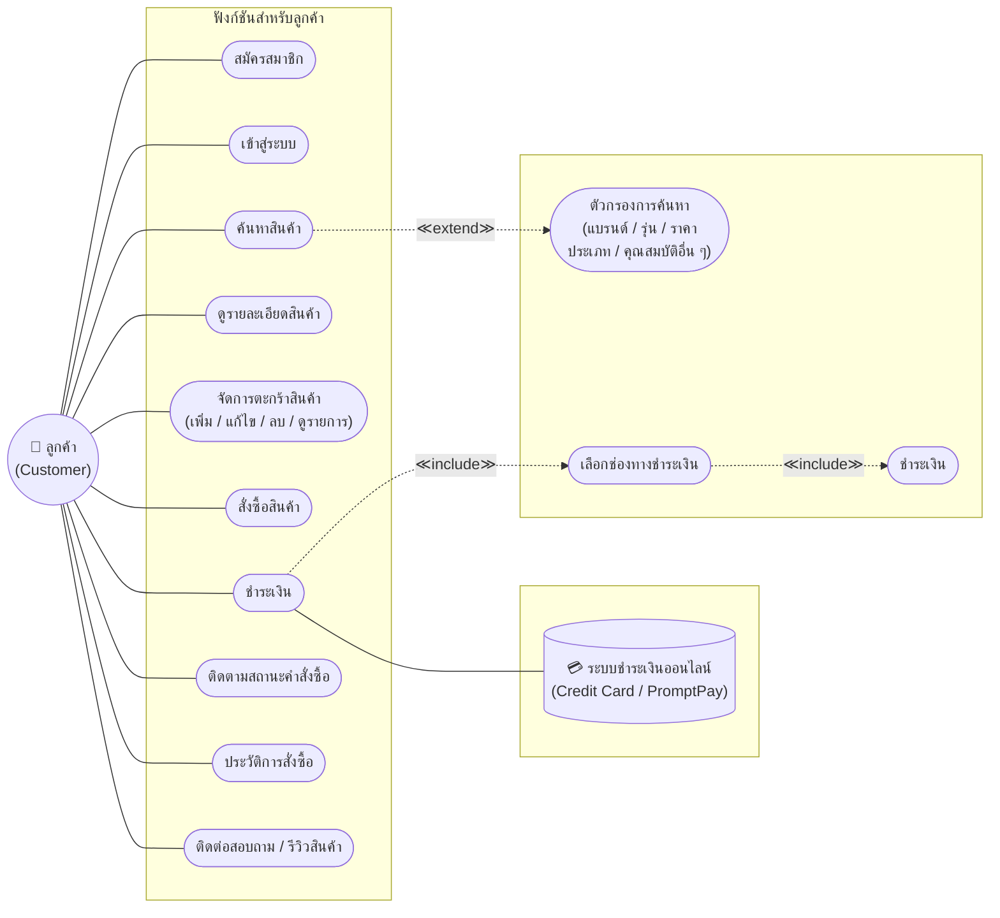
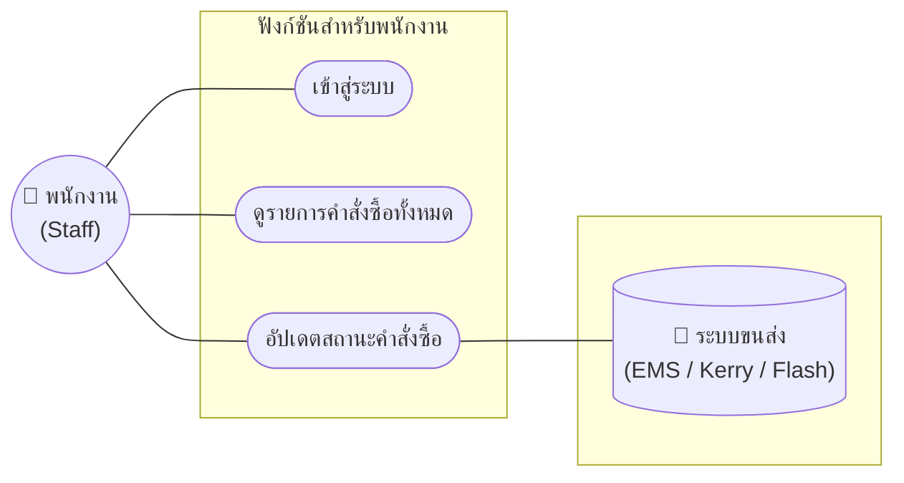
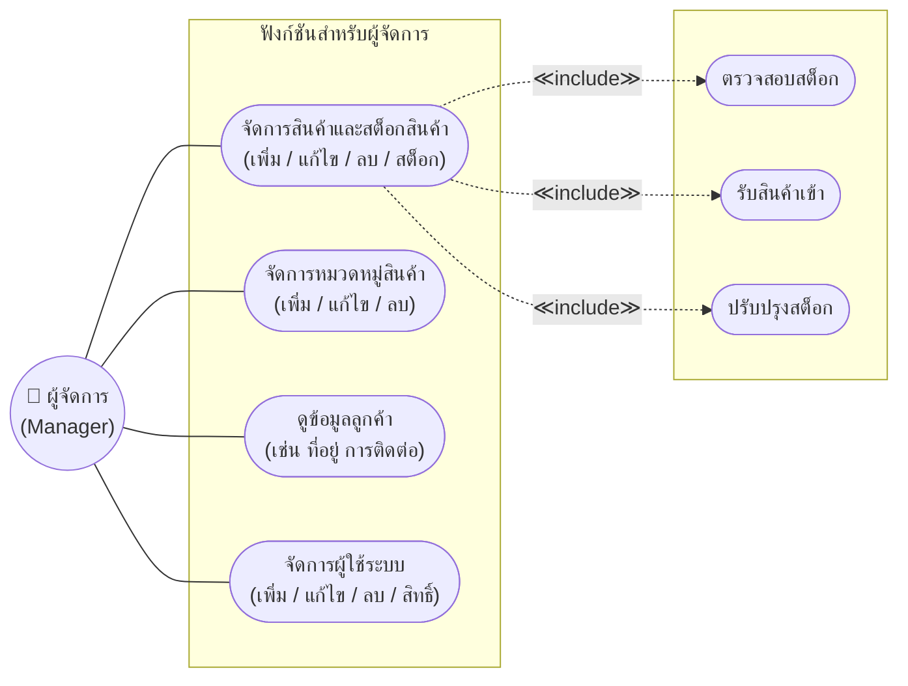
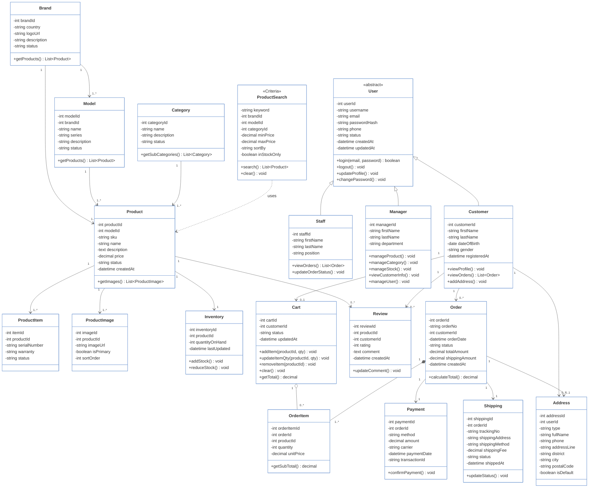
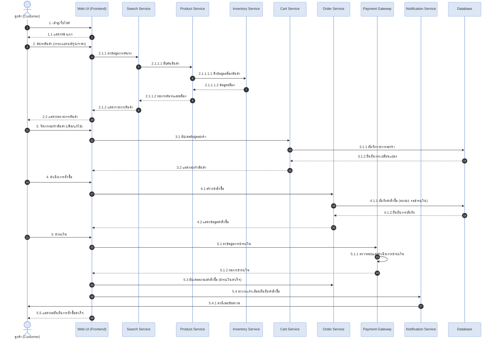
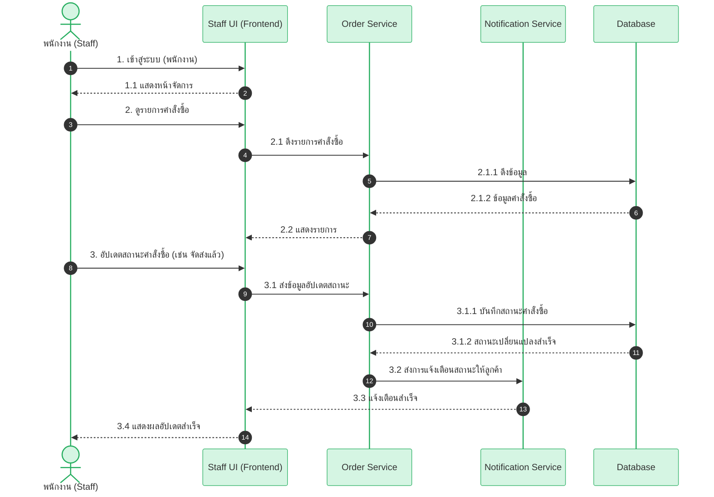
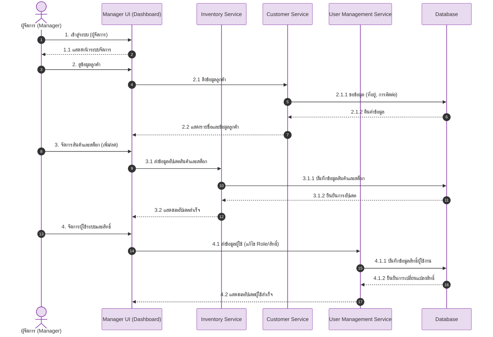

# 🖥️ PC Center – ศูนย์รวมคอมพิวเตอร์และอุปกรณ์ไอที

## 📌 CSI204 Project Hub
ระบบเว็บไซต์ขายคอมพิวเตอร์และอุปกรณ์ไอทีออนไลน์ (E-Commerce Platform)

---

## 📚 สารบัญ (Table of Contents)

1. [ข้อเสนอโครงงาน (Project Proposal)](#1-ข้อเสนอโครงงาน-project-proposal)
2. [Persona Design](#2-persona-design)
3. [การประยุกต์ใช้เครื่องมือในกระบวนการ SDLC](#3-การประยุกต์ใช้เครื่องมือในกระบวนการ-sdlc)
4. [Use Case Diagram](#4-use-case-diagram)
5. [Class Diagram](#5-class-diagram)
6. [แผนภาพลำดับการทำงาน (Sequence Diagram)](#6-แผนภาพลำดับการทำงาน-sequence-diagram)
7. [Wireframe และ Prototype](#7-wireframe-และ-prototype)
8. [System Architecture](#8-system-architecture)
9. [Tools & Technologies](#9-tools--technologies)
10. [Data Schema (JSON)](#10-data-schema-json)
11. [User Acceptance Testing](#11-user-acceptance-testing)

---

## 1. ข้อเสนอโครงงาน (Project Proposal)

* **ชื่อกลุ่ม:** PC Center
* **ชื่อโครงงาน (ภาษาไทย):** PC Center – ศูนย์รวมคอมพิวเตอร์และอุปกรณ์ไอที
* **ชื่อโครงงาน (ภาษาอังกฤษ):** PC Center – Online PC & IT Equipment Store

### 📝 ความเป็นมาและความสำคัญ (Background & Significance)
ปัจจุบันคอมพิวเตอร์และอุปกรณ์ไอทีมีความสำคัญอย่างมาก แต่ร้านค้าหลายแห่งยังขาดช่องทางออนไลน์ที่ช่วยให้ลูกค้าค้นหาและสั่งซื้อได้อย่างสะดวกรวดเร็ว โครงงานนี้จึงพัฒนาเว็บไซต์จำหน่ายอุปกรณ์ไอทีแบบครบวงจร ที่มีหน้าร้านทันสมัย ใช้งานง่าย เพื่อให้ลูกค้าเลือกซื้อสินค้าได้ตลอด 24 ชั่วโมง พร้อมทั้งพัฒนาระบบจัดการหลังบ้าน (Dashboard) ที่มีการแบ่งระดับสิทธิ์ผู้ใช้งานอย่างเป็นระบบ ซึ่งจะช่วยให้ร้านค้าสามารถบริหารจัดการสต็อกสินค้าและคำสั่งซื้อได้อย่างมีประสิทธิภาพ

### 👥 สมาชิกในกลุ่ม (Group Members)

| ลำดับ | รหัสนักศึกษา | ชื่อ-สกุล | หน้าที่รับผิดชอบ |
| :---: | :---: | :--- | :--- |
| 1 | 67090746 | นายธนากร ธิติพุทธปราสาท | Project Manager |
| 2 | 66097958 |นายยศพล เปี่ยมบางแวก | full stack dev |
| 3 | 66097807 | นายเป็นไท ศรีไชยมูล | full stack dev |

### 🎯 วัตถุประสงค์ (Objectives)
1. เพื่อออกแบบและพัฒนาเว็บไซต์อีคอมเมิร์ซสำหรับจำหน่ายอุปกรณ์คอมพิวเตอร์ ที่มีดีไซน์ทันสมัย ใช้งานง่าย
2. เพื่อพัฒนาระบบหน้าร้าน (Storefront) ที่ช่วยอำนวยความสะดวกให้ลูกค้าสามารถค้นหา กรองหมวดหมู่สินค้า จัดการตะกร้า และทำรายการสั่งซื้อได้อย่างรวดเร็ว
3. เพื่อพัฒนาระบบจัดการหลังบ้าน (Dashboard) ที่มีการแบ่งระดับสิทธิ์การเข้าถึง (Role-based Access Control) เพื่อให้ทีมงานสามารถบริหารจัดการสินค้า คำสั่งซื้อ และข้อมูลผู้ใช้ได้อย่างมีประสิทธิภาพ

### 🔍 ขอบเขตของโครงงาน (Project Scope)
* **Customer (ลูกค้า):**
  - ระบบสมัครสมาชิกและเข้าสู่ระบบ
  - ระบบค้นหาและกรองสินค้าตามหมวดหมู่
  - ระบบดูรายละเอียดสินค้า
  - ระบบจัดการตะกร้าสินค้า
  - ระบบสั่งซื้อสินค้าและชำระเงิน
  - ระบบติดตามสถานะคำสั่งซื้อและประวัติการสั่งซื้อ
  - ระบบติดต่อสอบถามและรีวิวสินค้า
* **Staff (พนักงาน):**
  - ระบบเข้าสู่ระบบ
  - ระบบดูรายการคำสั่งซื้อทั้งหมด
  - ระบบอัปเดตสถานะคำสั่งซื้อ
* **Manager (ผู้จัดการ):**
  - ระบบจัดการหมวดหมู่สินค้า (เพิ่ม / แก้ไข / ลบ)
  - ระบบจัดการสต็อกสินค้า
  - ระบบดูข้อมูลลูกค้า (เช่น ที่อยู่ การติดต่อ)
  - ระบบจัดการผู้ใช้ระบบ (เพิ่ม / แก้ไข / ลบ / สิทธิ์)

### 📊 ความเป็นไปได้ของโครงงาน (Project Feasibility)
* **ด้านเทคนิค:** ใช้เทคโนโลยี Next.js ที่ผู้พัฒนาคุ้นเคยและมีแหล่งข้อมูลสนับสนุนครบถ้วน
* **ด้านงบประมาณ:** ใช้เครื่องมือฟรีทั้งหมด
* **ด้านเวลา:** สามารถพัฒนาให้เสร็จภายในระยะเวลาของรายวิชา

---

## 2. Persona Design

### 👤 Persona 1: Customer
Name: ลูกค้าทั่วไป / นักศึกษา / ผู้ใช้งานทั่วไป
Age: 18 - 35
Occupation: Student / Freelancer / Office Worker

Goals:
- ค้นหาและเปรียบเทียบสินค้า (CPU, GPU และอุปกรณ์คอมพิวเตอร์)
- สั่งซื้อสินค้าออนไลน์ได้สะดวก
- ติดตามสถานะคำสั่งซื้อของตนเอง

Pain Points:
- เดินทางไปร้านค้าไม่สะดวก
- ข้อมูลสินค้าไม่ครบถ้วน
- ไม่สามารถตรวจสอบสถานะคำสั่งซื้อได้ง่าย

Needs:
- เว็บไซต์ใช้งานง่าย
- ค้นหาและกรองสินค้าตามหมวดหมู่ได้
- มีรายละเอียดสินค้าชัดเจน
- จัดการตะกร้าสินค้าและสั่งซื้อออนไลน์ได้
- ติดตามสถานะคำสั่งซื้อได้

### 🧑‍💼 Persona 2: Staff
Name: พนักงานขาย / เจ้าหน้าที่ดูแลระบบ
Age: 22 - 40
Occupation: Sales Staff

Goals:
- ตรวจสอบคำสั่งซื้อของลูกค้า
- อัปเดตสถานะคำสั่งซื้อได้อย่างรวดเร็ว
- ดูข้อมูลลูกค้าเพื่อให้บริการได้สะดวก

Pain Points:
- การติดตามคำสั่งซื้อหลายรายการทำได้ยาก
- การค้นหาข้อมูลลูกค้าใช้เวลานาน

Needs:
- Dashboard แสดงภาพรวมของระบบ
- ระบบจัดการคำสั่งซื้อที่ใช้งานง่าย
- สามารถดูข้อมูลลูกค้าและอัปเดตสถานะคำสั่งซื้อได้

### 👨‍💼 Persona 3: Manager
Name: ผู้จัดการร้าน
Age: 30 - 50
Occupation: Store Manager / Business Owner

Goals:
- จัดการข้อมูลสินค้าและหมวดหมู่สินค้า
- บริหารจัดการสิทธิ์ผู้ใช้งานในระบบ
- ตรวจสอบการดำเนินงานของพนักงานและคำสั่งซื้อ

Pain Points:
- การจัดการสินค้าและผู้ใช้งานจำนวนมากใช้เวลานาน
- ต้องการควบคุมสิทธิ์การเข้าถึงของผู้ใช้งานแต่ละระดับ

Needs:
- ระบบหลังบ้านที่ใช้งานง่าย
- เพิ่ม แก้ไข และลบข้อมูลสินค้าและหมวดหมู่ได้
- จัดการสิทธิ์ผู้ใช้งาน (Role Management) ได้
- เข้าถึงทุกฟังก์ชันของ Staff และตรวจสอบข้อมูลภาพรวมของระบบได้

---

## 3. การประยุกต์ใช้เครื่องมือในกระบวนการ SDLC

ทีมของเราเลือกใช้เครื่องมือต่างๆ ในแต่ละขั้นตอนของการพัฒนาโปรเจกต์ (SDLC) ดังนี้:

### 3.1 Planning (การวางแผน)
* **เครื่องมือที่ใช้:** GitHub Projects, Discord
* **เหตุผล:** เราต้องการระบบที่ช่วยแบ่งงานให้คนในทีมและอัปเดตงานได้ง่ายๆ รวมถึงมีช่องทางไว้แชทคุยและประชุมงานกัน
* **การนำไปใช้งาน:** เราใช้ GitHub Projects เพื่อลิสต์ว่าใครต้องทำอะไรบ้าง และงานถึงไหนแล้ว ส่วน Discord เอาไว้พูดคุยและอัปเดตความคืบหน้าของทีม

### 3.2 Analysis & Design (การวิเคราะห์และออกแบบ)
* **เครื่องมือที่ใช้:** Figma, Mermaid.js
* **เหตุผล:** Figma ใช้งานง่ายและเหมาะกับการออกแบบหน้าจอเว็บ ส่วน Mermaid.js ช่วยให้เราเขียนแผนภาพระบบผ่านการเขียนโค้ดง่ายๆ (Markdown)
* **การนำไปใช้งาน:** เราใช้ Mermaid.js วาดแผนภาพการทำงานของระบบ (เช่น Use Case, Class, Sequence Diagram) และใช้ Figma ออกแบบโครงร่างเว็บ (Wireframe) รวมถึงทำตัวต้นแบบเว็บที่กดโต้ตอบได้จริง (Prototype)

### 3.3 Development (การพัฒนา)
* **เครื่องมือที่ใช้:** VS Code, Git/GitHub, Next.js, Tailwind CSS
* **เหตุผล:** เป็นกลุ่มเครื่องมือยอดฮิตที่ช่วยให้เราสร้างเว็บได้เร็วขึ้น และสามารถแชร์โค้ดทำงานร่วมกันหลายคนได้อย่างเป็นระบบ
* **การนำไปใช้งาน:** ทีมใช้ VS Code เพื่อเขียนโค้ดตัวเว็บด้วยเฟรมเวิร์ก Next.js แล้วตกแต่งความสวยงามด้วย Tailwind CSS จากนั้นจะส่งโค้ดทั้งหมดไปรวมและเก็บรักษาไว้บน GitHub

### 3.4 Testing (การทดสอบ)
* **เครื่องมือที่ใช้:** Chrome DevTools, Postman
* **เหตุผล:** เป็นเครื่องมือพื้นฐานในการใช้ตรวจเช็กความเรียบร้อยของหน้าเว็บ และเช็กการทำงานของระบบหลังบ้าน (API)
* **การนำไปใช้งาน:** เราใช้ Chrome DevTools เพื่อทดสอบว่าหน้าเว็บแสดงผลบนมือถือได้พอดีไหม และเช็กระบบตะกร้าสินค้าในเบราว์เซอร์ ส่วน Postman เราใช้จำลองการส่งข้อมูลไปที่ระบบหลังบ้านเพื่อดูว่าตอบกลับมาถูกต้องหรือไม่

### 3.5 Deployment (การนำเว็บขึ้นออนไลน์)
* **เครื่องมือที่ใช้:** Vercel
* **เหตุผล:** ใช้งานฟรี สะดวก และทำงานเข้ากับ Next.js ได้อย่างไร้รอยต่อ
* **การนำไปใช้งาน:** เราเชื่อมต่อ Vercel เข้ากับ GitHub ของโปรเจกต์ เมื่อมีคนในทีมอัปเดตโค้ดเวอร์ชันใหม่ลงในระบบ Vercel จะทำการประมวลผลและอัปเดตเว็บไซต์ออนไลน์ให้ใหม่โดยอัตโนมัติ

---

## 4. Use Case Diagram



### 4.2 ฟังก์ชันสำหรับพนักงาน (Staff)



### 4.3 ฟังก์ชันสำหรับผู้จัดการ (Manager)



---

## 5. Class Diagram



---

## 6. แผนภาพลำดับการทำงาน (Sequence Diagram)

### 6.1 กระบวนการของลูกค้า : ค้นหาสินค้าและสั่งซื้อ



### 6.2 กระบวนการของพนักงาน : จัดการออเดอร์



### 6.3 กระบวนการของผู้จัดการ : จัดการข้อมูลลูกค้า สินค้า และผู้ใช้ระบบ



---

## 7. Wireframe และ Prototype

**Figma Design & Prototype:** [PC-Center Figma](https://www.figma.com/design/IYlNf0A4R423lRC0onIuXK/PC-Center?node-id=0-1&t=R5KfjKv478bxXQKn-1)


---

## 8. System Architecture


---

## 9. Tools & Technologies

* **Frontend Framework:** Next.js (React), TypeScript
* **Styling & UI:** Tailwind CSS, shadcn/ui, Lucide React
* **Design:** Figma
* **Version Control:** Git, GitHub
* **Storage / Data:** LocalStorage (Browser) / Client-side Mock Data

---

## 10. Data Schema (JSON)

**👤 User**
```json
{
  "user_id": 1,
  "name": "John Doe",
  "email": "john@gmail.com",
  "role": "customer"
}
```

**📦 Product**
```json
{
  "product_id": 1,
  "name": "Gaming Mouse",
  "price": 599,
  "stock": 20,
  "category": "Mouse"
}
```

**🏷️ Product Item (Warranty)**
```json
{
  "item_id": 101,
  "product_id": 1,
  "serial_number": "SN-123456789",
  "warranty": "1 Year",
  "status": "Available"
}
```

**🛒 Cart**
```json
{
  "cart_id": 1,
  "user_id": 1,
  "items": [
    {
      "product_id": 1,
      "quantity": 2,
      "price": 599
    }
  ]
}
```

**📑 Order**
```json
{
  "order_id": 1,
  "user_id": 1,
  "items": [
    {
      "product_id": 1,
      "quantity": 2,
      "unit_price": 599
    }
  ],
  "total_price": 1198,
  "status": "pending",
  "created_at": "2024-10-25T10:00:00Z"
}
```
