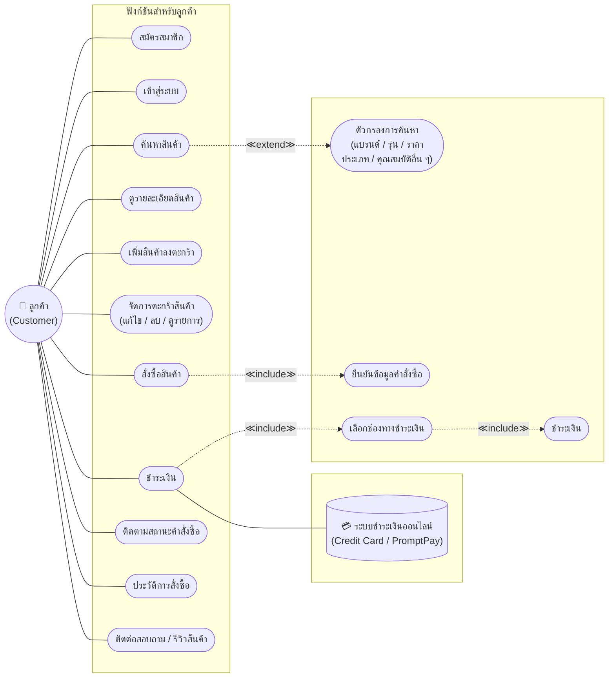
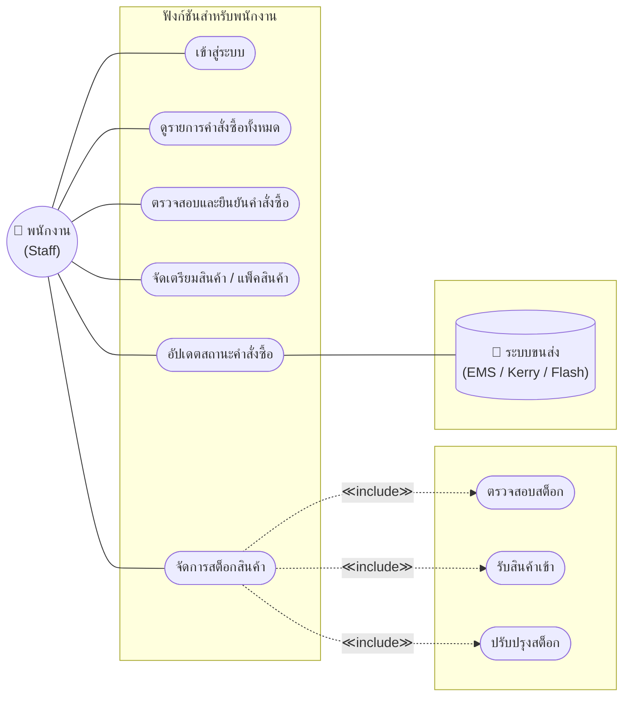
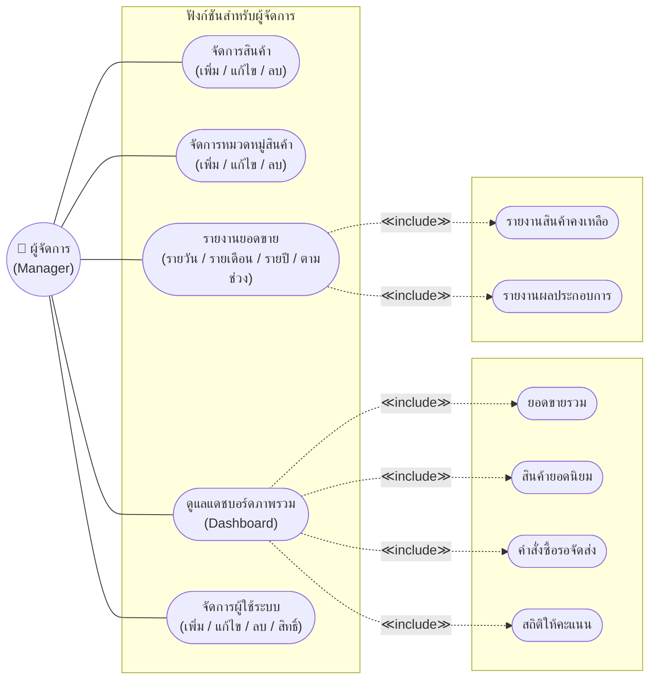
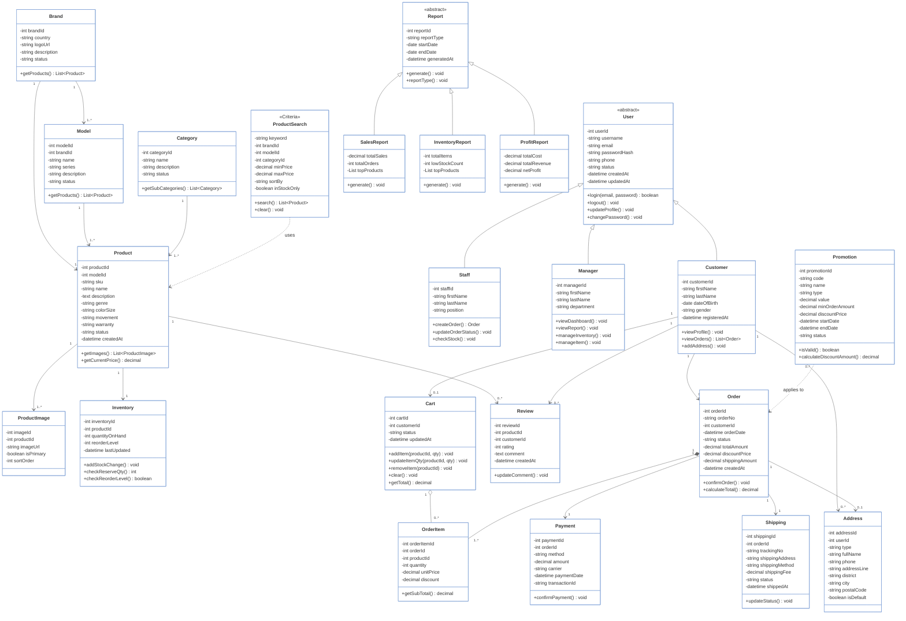
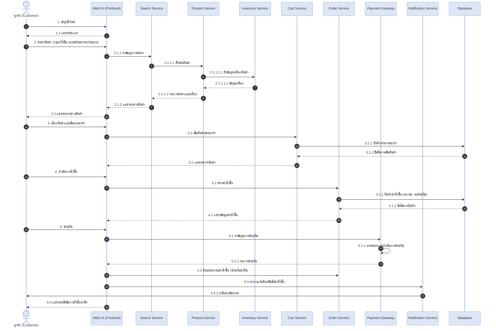
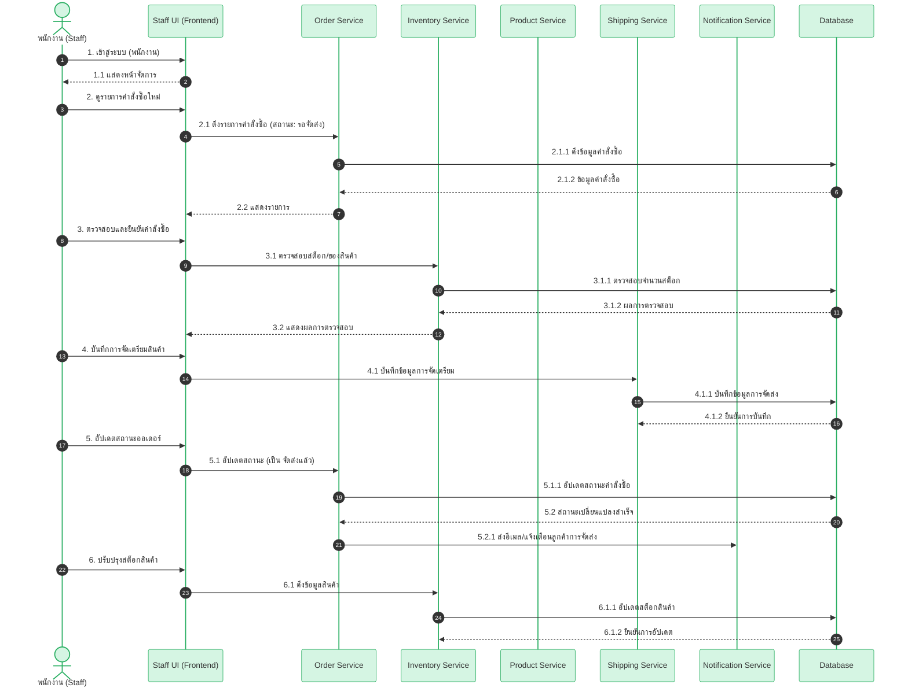
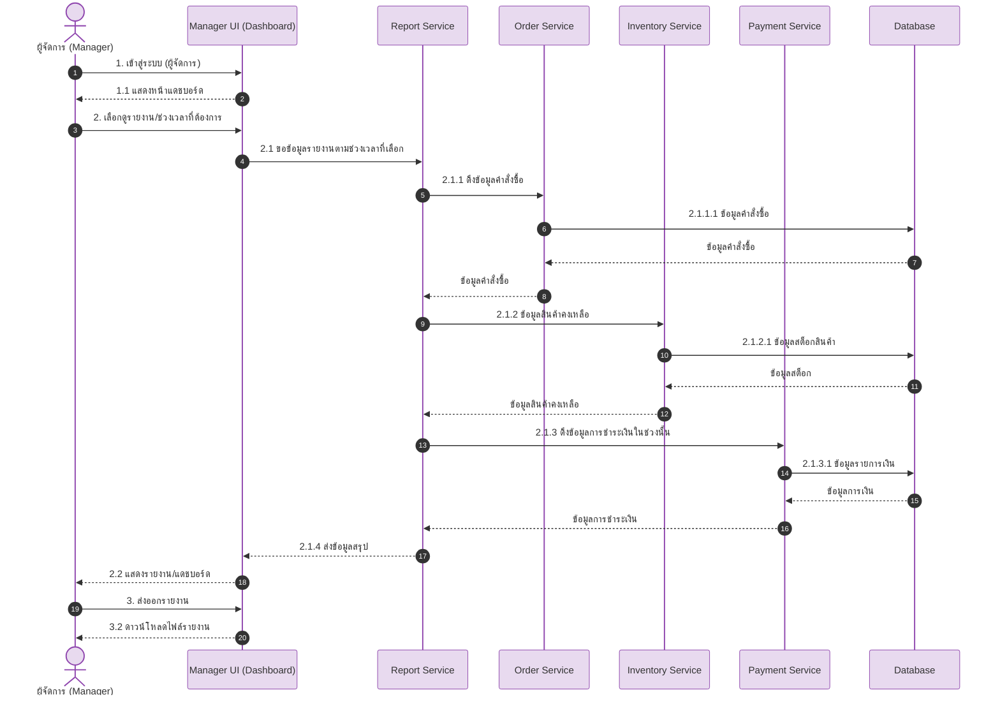
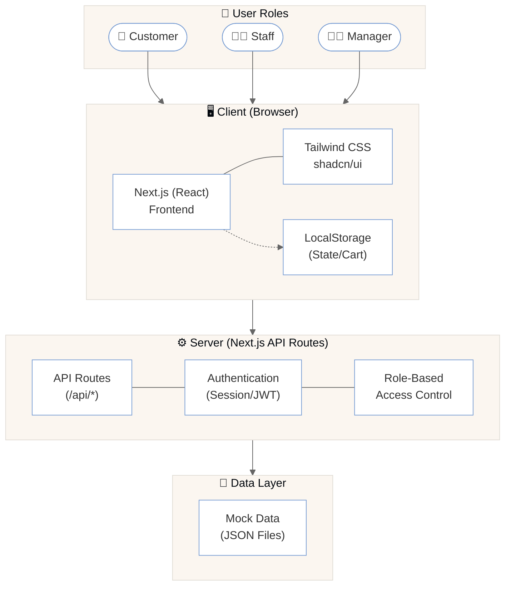

# 🖥️ PC Center – ศูนย์รวมคอมพิวเตอร์และอุปกรณ์ไอที

## 📌 CSI204 Project Hub
ระบบเว็บไซต์ขายคอมพิวเตอร์และอุปกรณ์ไอทีออนไลน์ (E-Commerce Platform)

---

## 📚 สารบัญ (Table of Contents)

1. [ข้อเสนอโครงงาน (Project Proposal)](#1-ข้อเสนอโครงงาน-project-proposal)
2. [Persona Design](#2-persona-design)
3. [Use Case Diagram](#3-use-case-diagram)
4. [Class Diagram](#4-class-diagram)
5. [แผนภาพลำดับการทำงาน (Sequence Diagram)](#5-แผนภาพลำดับการทำงาน-sequence-diagram)
6. [Wireframe](#6-wireframe)
7. [System Architecture](#7-system-architecture)
8. [Tools & Technologies](#8-tools--technologies)
9. [Data Schema (JSON)](#9-data-schema-json)
10. [Progress Report](#10-progress-report)

---

## 1. ข้อเสนอโครงงาน (Project Proposal)

* **ชื่อกลุ่ม:** PC Center
* **ชื่อโครงงาน (ภาษาไทย):** PC Center – ศูนย์รวมคอมพิวเตอร์และอุปกรณ์ไอที
* **ชื่อโครงงาน (ภาษาอังกฤษ):** PC Center – Online PC & IT Equipment Store

### 📝 ความเป็นมาและความสำคัญ (Background & Significance)
ปัจจุบันคอมพิวเตอร์และอุปกรณ์ไอทีมีความสำคัญอย่างมาก แต่ร้านค้าหลายแห่งยังขาดช่องทางออนไลน์ที่ช่วยให้ลูกค้าค้นหาและสั่งซื้อได้อย่างสะดวกรวดเร็ว โครงงานนี้จึงพัฒนาเว็บไซต์จำหน่ายอุปกรณ์ไอทีแบบครบวงจร ที่มีหน้าร้านทันสมัย ใช้งานง่าย เพื่อให้ลูกค้าเลือกซื้อสินค้าได้ตลอด 24 ชั่วโมง พร้อมทั้งพัฒนาระบบจัดการหลังบ้าน (Dashboard) ที่มีการแบ่งระดับสิทธิ์ผู้ใช้งานอย่างเป็นระบบ ซึ่งจะช่วยให้ร้านค้าสามารถบริหารจัดการสต็อกสินค้าและคำสั่งซื้อได้อย่างมีประสิทธิภาพ

### 👥 สมาชิกในกลุ่ม (Group Members)

| ลำดับ | รหัสนักศึกษา | ชื่อ-สกุล | หน้าที่รับผิดชอบ |
| :---: | :---: | :--- | :--- |
| 1 | [รหัส] | [ชื่อ-สกุล] | Project Manager |
| 2 | 67090746 | นายธนากร ธิติพุทธปราสาท | full stack dev |
| 3 | 66097807 | นายเป็นไท ศรีไชยมูล | [หน้าที่] |
| 4 | [รหัส] | [ชื่อ-สกุล] | [หน้าที่] |
| 5 | [รหัส] | [ชื่อ-สกุล] | [หน้าที่] |

### 🎯 วัตถุประสงค์ (Objectives)
1. เพื่อออกแบบและพัฒนาเว็บไซต์อีคอมเมิร์ซสำหรับจำหน่ายอุปกรณ์คอมพิวเตอร์ ที่มีดีไซน์ทันสมัย ใช้งานง่าย
2. เพื่อพัฒนาระบบหน้าร้าน (Storefront) ที่ช่วยอำนวยความสะดวกให้ลูกค้าสามารถค้นหา กรองหมวดหมู่สินค้า จัดการตะกร้า และทำรายการสั่งซื้อได้อย่างรวดเร็ว
3. เพื่อพัฒนาระบบจัดการหลังบ้าน (Dashboard) ที่มีการแบ่งระดับสิทธิ์การเข้าถึง (Role-based Access Control) เพื่อให้ทีมงานสามารถบริหารจัดการสินค้า คำสั่งซื้อ และข้อมูลผู้ใช้ได้อย่างมีประสิทธิภาพ

### 🔍 ขอบเขตของโครงงาน (Project Scope)
* **Customer (ลูกค้า):** สามารถเข้าสู่ระบบ, ค้นหาและกรองสินค้าตามหมวดหมู่ (เช่น CPU, GPU), ดูรายละเอียด, จัดการตะกร้าสินค้า, ทำรายการสั่งซื้อ (ระบบจำลองการชำระเงิน) และติดตามสถานะคำสั่งซื้อของตนเองได้
* **Staff (พนักงาน):** สามารถเข้าสู่ระบบจัดการหลังบ้าน, ดูภาพรวมแดชบอร์ด (Dashboard), จัดการและอัปเดตสถานะคำสั่งซื้อของลูกค้า และดูฐานข้อมูลลูกค้าได้
* **Manager (ผู้จัดการ):** มีสิทธิ์สูงสุดครอบคลุมการทำงานของพนักงาน และสามารถจัดการเพิ่ม/ลด/แก้ไขข้อมูลสินค้า, หมวดหมู่สินค้า, บริหารจัดการสิทธิ์ผู้ใช้งาน (Role) ของบุคคลอื่นในระบบได้

### 📊 ความเป็นไปได้ของโครงงาน (Project Feasibility)
* **ด้านเทคนิค:** ใช้เทคโนโลยี Next.js ที่ผู้พัฒนาคุ้นเคยและมีแหล่งข้อมูลสนับสนุนครบถ้วน
* **ด้านงบประมาณ:** ใช้เครื่องมือฟรีทั้งหมด
* **ด้านเวลา:** สามารถพัฒนาให้เสร็จภายในระยะเวลาของรายวิชา

---

## 2. Persona Design

### 👤 Persona 1: Customer
Name: ลูกค้าทั่วไป / นักศึกษา / ผู้ใช้งานทั่วไป
Age: 18 - 35
Occupation: Student / Freelancer / Office Worker

Goals:
- ค้นหาและเปรียบเทียบสินค้า (CPU, GPU และอุปกรณ์คอมพิวเตอร์)
- สั่งซื้อสินค้าออนไลน์ได้สะดวก
- ติดตามสถานะคำสั่งซื้อของตนเอง

Pain Points:
- เดินทางไปร้านค้าไม่สะดวก
- ข้อมูลสินค้าไม่ครบถ้วน
- ไม่สามารถตรวจสอบสถานะคำสั่งซื้อได้ง่าย

Needs:
- เว็บไซต์ใช้งานง่าย
- ค้นหาและกรองสินค้าตามหมวดหมู่ได้
- มีรายละเอียดสินค้าชัดเจน
- จัดการตะกร้าสินค้าและสั่งซื้อออนไลน์ได้
- ติดตามสถานะคำสั่งซื้อได้

### 🧑‍💼 Persona 2: Staff
Name: พนักงานขาย / เจ้าหน้าที่ดูแลระบบ
Age: 22 - 40
Occupation: Sales Staff

Goals:
- ตรวจสอบคำสั่งซื้อของลูกค้า
- อัปเดตสถานะคำสั่งซื้อได้อย่างรวดเร็ว
- ดูข้อมูลลูกค้าเพื่อให้บริการได้สะดวก

Pain Points:
- การติดตามคำสั่งซื้อหลายรายการทำได้ยาก
- การค้นหาข้อมูลลูกค้าใช้เวลานาน

Needs:
- Dashboard แสดงภาพรวมของระบบ
- ระบบจัดการคำสั่งซื้อที่ใช้งานง่าย
- สามารถดูข้อมูลลูกค้าและอัปเดตสถานะคำสั่งซื้อได้

### 👨‍💼 Persona 3: Manager
Name: ผู้จัดการร้าน
Age: 30 - 50
Occupation: Store Manager / Business Owner

Goals:
- จัดการข้อมูลสินค้าและหมวดหมู่สินค้า
- บริหารจัดการสิทธิ์ผู้ใช้งานในระบบ
- ตรวจสอบการดำเนินงานของพนักงานและคำสั่งซื้อ

Pain Points:
- การจัดการสินค้าและผู้ใช้งานจำนวนมากใช้เวลานาน
- ต้องการควบคุมสิทธิ์การเข้าถึงของผู้ใช้งานแต่ละระดับ

Needs:
- ระบบหลังบ้านที่ใช้งานง่าย
- เพิ่ม แก้ไข และลบข้อมูลสินค้าและหมวดหมู่ได้
- จัดการสิทธิ์ผู้ใช้งาน (Role Management) ได้
- เข้าถึงทุกฟังก์ชันของ Staff และตรวจสอบข้อมูลภาพรวมของระบบได้

---

## 3. Use Case Diagram



### 3.2 ฟังก์ชันสำหรับพนักงาน (Staff)



### 3.3 ฟังก์ชันสำหรับผู้จัดการ (Manager)



---

## 4. Class Diagram



---

## 5. แผนภาพลำดับการทำงาน (Sequence Diagram)

### 5.1 กระบวนการของลูกค้า : ค้นหาสินค้าและสั่งซื้อ



### 5.2 กระบวนการของพนักงาน : จัดการออเดอร์และสต็อกสินค้า



### 5.3 กระบวนการของผู้จัดการ : ดูรายงานและแดชบอร์ด



---

## 6. Wireframe

*(ระบุลิงก์ Figma หรือแทรกรูปภาพ Wireframe ของคุณที่นี่)*

---

## 7. System Architecture



---

## 8. Tools & Technologies

* **Frontend Framework:** Next.js (React), TypeScript
* **Styling & UI:** Tailwind CSS, shadcn/ui, Lucide React
* **Design:** Figma
* **Version Control:** Git, GitHub
* **Storage / Data:** LocalStorage (Browser) / Client-side Mock Data

---

## 9. Data Schema (JSON)

**👤 User**
```json
{
  "user_id": 1,
  "name": "John Doe",
  "email": "john@gmail.com",
  "role": "customer"
}
```

**📦 Product**
```json
{
  "product_id": 1,
  "name": "Gaming Mouse",
  "price": 599,
  "stock": 20,
  "category": "Mouse"
}
```

**🛒 Cart**
```json
{
  "cart_id": 1,
  "user_id": 1,
  "items": [
    {
      "product_id": 1,
      "quantity": 2,
      "price": 599
    }
  ]
}
```

**📑 Order**
```json
{
  "order_id": 1,
  "user_id": 1,
  "items": [
    {
      "product_id": 1,
      "quantity": 2,
      "unit_price": 599
    }
  ],
  "total_price": 1198,
  "status": "pending",
  "created_at": "2024-10-25T10:00:00Z"
}
```

---

## 10. Progress Report
